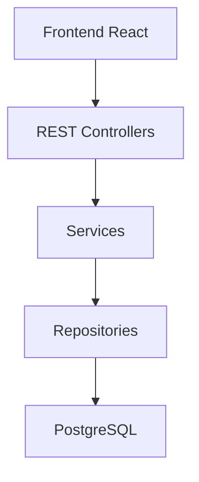

# Beverage POS

[](https://github.com/Guilossantos/beverage-pos/actions/workflows/backend-ci.yml)

Projeto full-stack de portfólio desenvolvido para aplicar, de forma prática, o ciclo de construção de um produto de software: levantamento de requisitos, modelagem de domínio, desenvolvimento de API REST, persistência, testes automatizados, integração contínua, frontend e publicação em nuvem.

O contexto escolhido foi um sistema de ponto de venda e controle de estoque para pequenos estabelecimentos comerciais.

> Projeto em desenvolvimento com foco em aprendizado prático de Java, Spring Boot, PostgreSQL, React, testes, Docker, CI/CD e AWS.

## Objetivos técnicos

Este repositório tem como objetivos:

- desenvolver uma API REST com Java e Spring Boot;
- aplicar arquitetura em camadas;
- modelar entidades e relacionamentos com JPA;
- persistir dados em PostgreSQL;
- controlar migrações com Flyway;
- implementar regras de negócio e transações;
- desenvolver testes com JUnit e Mockito;
- integrar um frontend React;
- utilizar Git e Pull Requests em um fluxo próximo ao ambiente profissional;
- executar build e testes com GitHub Actions;
- containerizar a aplicação com Docker;
- publicar o projeto na AWS.

## Escopo do MVP

A primeira versão terá uma única conta de acesso e permitirá:

- cadastrar, consultar e editar produtos;
- ativar e inativar produtos;
- controlar estoque atual e estoque mínimo;
- identificar produtos com estoque baixo;
- registrar e finalizar vendas;
- impedir vendas sem estoque suficiente;
- reduzir o estoque automaticamente;
- preservar nome e preço dos produtos vendidos;
- consultar o histórico de vendas;
- acompanhar indicadores em um dashboard.

Múltiplos usuários, perfis de acesso, pagamentos, emissão fiscal e integrações externas estão fora do MVP.

A decisão de utilizar uma única conta foi tomada para manter o projeto concentrado nos principais objetivos do roadmap: API, banco de dados, frontend, testes, DevOps e cloud.

## Regras de negócio em destaque

- O estoque nunca pode ficar negativo.
- Somente produtos cadastrados e ativos podem ser vendidos.
- A quantidade vendida deve ser um número inteiro maior que zero.
- O estoque é validado novamente durante a finalização.
- A criação da venda e a redução do estoque formam uma única operação.
- Falhas não podem gerar vendas ou atualizações parciais.
- Nome e preço são preservados no item da venda.
- Alterações posteriores no produto não modificam o histórico.
- Vendas finalizadas não podem ser editadas ou excluídas no MVP.

## Arquitetura planejada

O backend será inicialmente desenvolvido como uma aplicação monolítica organizada em camadas e consumida por um frontend React separado.



Responsabilidades:

- **Controllers:** receber requisições e produzir respostas HTTP;
- **Services:** executar casos de uso e regras de negócio;
- **Repositories:** realizar o acesso aos dados;
- **Domain:** representar produtos, vendas e itens;
- **DTOs:** definir os dados de entrada e saída da API;
- **Flyway:** controlar a evolução do banco de dados.

## Domínio inicial

O domínio será composto inicialmente por três entidades:

- `Product`;
- `Sale`;
- `SaleItem`.

Relacionamentos:

```text
Sale    1 ─────── 1..* SaleItem
Product 1 ─────── 0..* SaleItem
```

`SaleItem` preservará o nome e o preço existentes no momento da venda. O estoque atual e o estoque mínimo ficarão em `Product`.

Histórico, dashboard e carrinho não serão entidades separadas:

- o histórico será uma consulta de vendas;
- o dashboard será formado por consultas e cálculos;
- o carrinho permanecerá temporariamente no frontend.

## Stack

| Área | Tecnologias | Situação |
|---|---|---|
| Backend | Java 21, Spring Boot e Maven | Fundação configurada |
| API | Spring Web e API REST | Em desenvolvimento |
| Persistência | Spring Data JPA, PostgreSQL e Flyway | Planejado |
| Segurança | Spring Security com uma conta configurada | Planejado |
| Frontend | React e Vite | Planejado |
| Testes | JUnit e Mockito | Estrutura inicial disponível |
| CI | GitHub Actions | Configurado |
| Containers | Docker | Planejado |
| Cloud | AWS | Planejado |

## Integração contínua

O backend possui um workflow no GitHub Actions que:

1. baixa o conteúdo do repositório;
2. configura Java 21;
3. utiliza cache das dependências Maven;
4. concede permissão ao Maven Wrapper;
5. executa build e testes com `mvn clean verify`.

O workflow é executado em alterações relevantes ao backend enviadas para `main` ou `develop`, além de Pull Requests direcionados a essas branches.

## Fluxo Git

O projeto utiliza:

- `main` para versões estáveis;
- `develop` como branch de integração;
- `feature/*` para novas funcionalidades;
- `fix/*` para correções;
- `release/*` para preparação de versões;
- `hotfix/*` para correções urgentes.

As alterações são realizadas em branches próprias e integradas por Pull Request. Os commits seguem a convenção Conventional Commits.

A documentação do processo está disponível em [`docs/development-workflow.md`](docs/development-workflow.md).

## Estrutura atual

```text
beverage-pos/
├── .github/
│   └── workflows/
│       └── backend-ci.yml
├── Backend/
│   ├── .mvn/
│   ├── src/
│   │   ├── main/
│   │   └── test/
│   ├── mvnw
│   ├── mvnw.cmd
│   └── pom.xml
├── docs/
│   └── development-workflow.md
├── .editorconfig
├── .gitignore
├── LICENSE
└── README.md
```

O diretório do frontend será adicionado quando a etapa React for iniciada.

## Executando a validação do backend

### Requisitos

- Java 21;
- Git.

O Maven não precisa estar instalado globalmente, pois o projeto utiliza Maven Wrapper.

### Windows

```powershell
cd Backend
.\mvnw.cmd clean verify
```

### Linux ou macOS

```bash
cd Backend
chmod +x mvnw
./mvnw clean verify
```

As instruções de execução completa serão atualizadas quando PostgreSQL, Docker e frontend forem integrados.

## Roadmap

- [x] Definição da visão e do escopo do MVP;
- [x] Documentação das regras e critérios de aceite;
- [x] Criação do projeto Spring Boot;
- [x] Configuração inicial do GitHub Actions;
- [x] Definição do fluxo Git;
- [x] Finalização do modelo de domínio;
- [ ] Integração com PostgreSQL e Flyway;
- [ ] Desenvolvimento da API de produtos;
- [ ] Desenvolvimento da finalização de vendas;
- [ ] Implementação do histórico e dashboard;
- [ ] Ampliação dos testes automatizados;
- [ ] Desenvolvimento do frontend React;
- [ ] Containerização com Docker;
- [ ] Configuração de entrega contínua;
- [ ] Publicação na AWS.

## Status

O projeto está na fase de fundação técnica e planejamento do domínio.

Já foram configurados:

- projeto Spring Boot com Java 21 e Maven;
- repositório com branches `main` e `develop`;
- fluxo baseado em feature branches e Pull Requests;
- integração contínua do backend com GitHub Actions;
- documentação inicial de requisitos, regras e critérios de aceite.

As próximas etapas serão a finalização do modelo de domínio e a integração com PostgreSQL e Flyway.

## Autor

**Guilherme Santos**

- GitHub: [Guilossantos](https://github.com/Guilossantos)
- LinkedIn: [Guilherme Santos](https://www.linkedin.com/in/Guilossantos/)

## Licença

Este projeto será disponibilizado sob a licença [MIT](LICENSE).